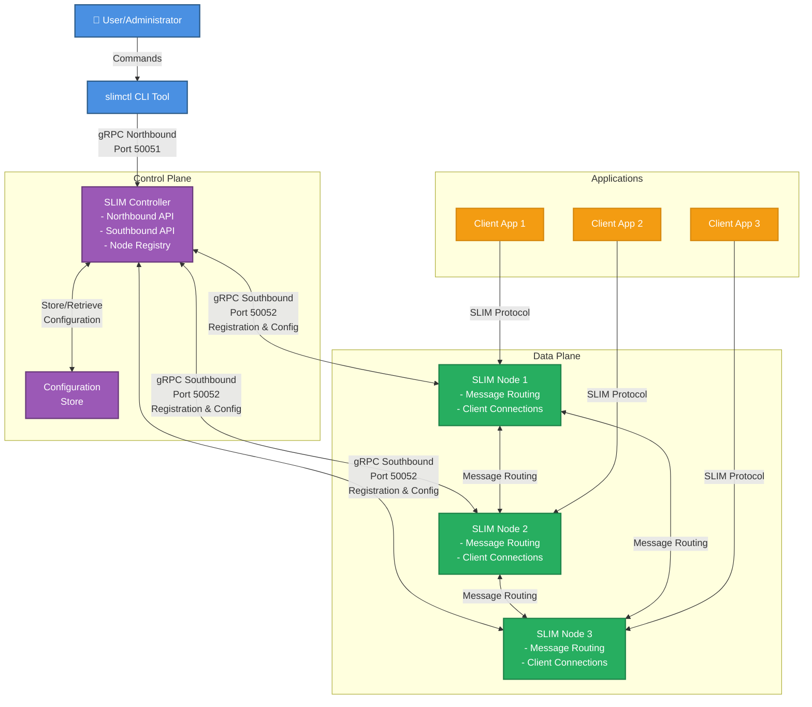
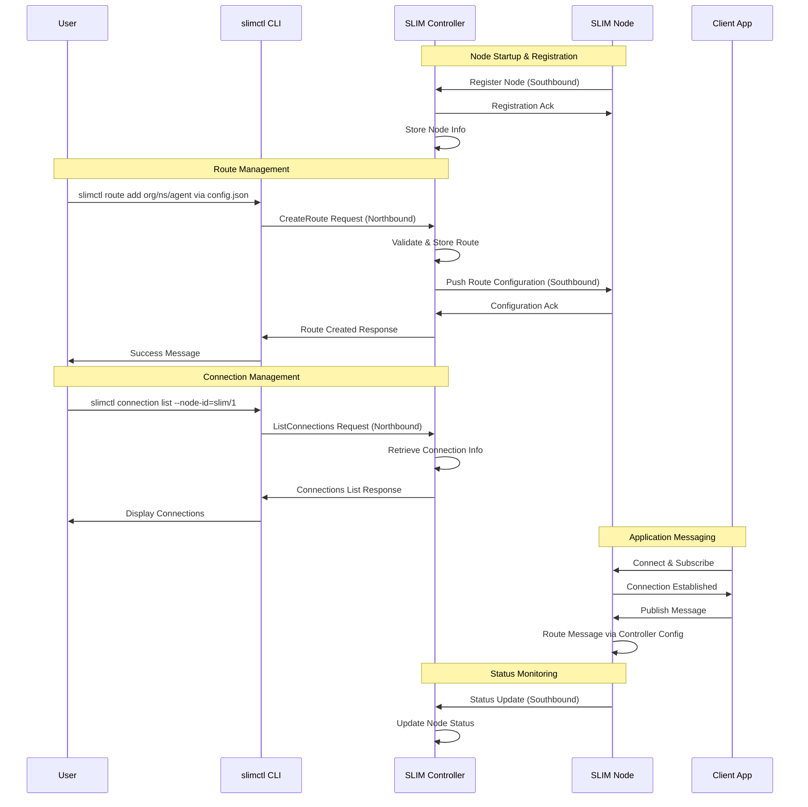

# SLIM Controller

The [SLIM](../) Controller is a central management component that
orchestrates and manages SLIM nodes in a distributed messaging system. It
provides a unified interface for configuring routes, managing node registration,
and coordinating communication between nodes.

The Controller serves as the central coordination point for SLIM infrastructure,
offering both northbound and southbound interfaces. The northbound interface
allows external systems and administrators to configure and manage the SLIM
network. The southbound interface enables SLIM nodes to register and receive
configuration updates.

## Controller Configuration

The Controller can be configured through the `config.yaml` file.

An example of a minimal configuration:

```yaml
northbound:
  httpHost: localhost
  httpPort: 50051
  logging:
    level: DEBUG

southbound:
  httpHost: localhost
  httpPort: 50052
  # number of node reconciler threads
  reconciler:
    threads: 3

logging:
  level: DEBUG
```

Example config to enable MTLS on Southbound endpoint using [Spire](https://spiffe.io/docs/latest/spire-about/spire-concepts/).

```yaml
  northbound:
    httpHost: 0.0.0.0
    httpPort: 50051

  southbound:
    httpHost: 0.0.0.0
    httpPort: 50052
      tls:
        useSpiffe: true
      spire:
        socketPath: "unix:///run/spire/agent-sockets/api.sock"

  logging:
    level: DEBUG

  reconciler:
    # Max number of times a failed reconcile will be retried
    maxRequeues: 15
    # Max number of reconciles that can be run in parallel for different nodes
    maxNumOfParallelReconciles: 1000

  # Specifies the SQLite database file path for storing control plane data
  database:
    filePath: controlplane.db

  spire:
    enabled: false
    # Slim Controller SVIDs will be federated with these trust domains
    trustedDomains: []
      # - cluster-a.example.org
      # - cluster-b.example.org
```

## slimctl

`slimctl` is a unified command-line interface for managing SLIM instances and the SLIM control plane. It provides commands for:

- **Local Development** - Run standalone SLIM instances for development and testing using production configurations
- **Route Management** - Configure message routing between services via the SLIM Control Plane
- **Connection Monitoring** - View and manage active connections on SLIM nodes
- **Direct Node Access** - Manage SLIM nodes directly without going through the Control Plane

### Command Groups

```bash
slimctl --help
Usage: slimctl [OPTIONS] <COMMAND>

Commands:
  version     Print version information
  config      Manage slimctl configuration
  node        Commands to interact with SLIM nodes directly
  controller  Commands to interact with the SLIM Control Plane
  slim        Commands for managing a local SLIM instance
  help        Print this message or the help of the given subcommand(s)
```

### Installing slimctl

`slimctl` is available for multiple operating systems and architectures.


#### Pre-built Binaries

Download from the [GitHub releases page](https://github.com/agntcy/slim/releases):

1. Download the binary for your OS and architecture
2. Extract the archive
3. Move `slimctl` to a directory in your `PATH`


#### Homebrew (macOS)

If you are using macOS, you can install slimctl via Homebrew:

```bash
brew tap agntcy/slim https://github.com/agntcy/slim.git
brew install slimctl
```


#### Building from Source

**Prerequisites**: Go 1.20+, Task (taskfile.dev)

```bash
# From repository root
cd control-plane
task control-plane:slimctl:build

# Binary location: .dist/bin/slimctl
```

### Configuring slimctl

`slimctl` supports configuration through a configuration file, environment variables, or command-line flags. It looks for the Control Plane configuration at the following locations:

- `$HOME/.slimctl/config.yaml`
- `./config.yaml` (current directory)
- Via `--config` flag

An example `config.yaml`:

```yaml
server: "127.0.0.1:46358"
timeout: "10s"
tls:
  insecure: false
  ca_file: "/path/to/ca.pem"
  cert_file: "/path/to/client.pem"
  key_file: "/path/to/client.key"
```

The `server` endpoint should point to a [SLIM Control](https://github.com/agntcy/slim/tree/slim-v1.1.0/control-plane/control-plane) endpoint which is a central service managing SLIM node configurations.

### Managing SLIM Nodes Directly

SLIM nodes can be configured to expose a Controller endpoint. slimctl can connect to this endpoint to manage the SLIM instance directly using the `node` sub-command, bypassing the central Control Plane.

To enable this, configure the node to host a server allowing the client to connect:

```yaml
  tracing:
    log_level: info
    display_thread_names: true
    display_thread_ids: true

  runtime:
    n_cores: 0
    thread_name: "slim-data-plane"
    drain_timeout: 10s

  services:
    slim/1:
      dataplane:
        servers: []
        clients: []
      controller:
        servers:
            - endpoint: "0.0.0.0:46358"
              tls:
                insecure: true # Or specify tls cert and key
        clients: []
```

**List connections on a SLIM instance:**

```bash
slimctl node connection list --server=<node_control_endpoint>
```

**List routes on a SLIM instance:**

```bash
slimctl node route list --server=<node_control_endpoint>
```

**Add a route to the SLIM instance:**

```bash
slimctl node route add <organization/namespace/agentName/agentId> via <config_file> --server=<node_control_endpoint>
```

**Delete a route from the SLIM instance:**

```bash
slimctl node route del <organization/namespace/agentName/agentId> via <host:port> --server=<node_control_endpoint>
```

## Key Features

- **Centralized Node Management**: Register and manage multiple SLIM nodes from a single control point.
- **Route Configuration**: Set up message routing between nodes through the Controller.
- **Bidirectional Communication**: Supports both northbound and southbound gRPC interfaces.
- **Connection Orchestration**: Manages connections and subscriptions between SLIM nodes.

## Architecture

The Controller implements northbound and southbound gRPC interfaces.

The northbound interface provides management capabilities for external systems
and administrators, such as [slimctl](#slimctl). It includes:

- **Route Management**: Create, list, and manage message routes between nodes.
- **Connection Management**: Set up and monitor connections between SLIM nodes.
- **Node Discovery**: List registered nodes and their status.

The southbound interface allows SLIM nodes to register with the Controller and
receive configuration updates. It includes:

- **Node Registration**: Nodes can register themselves with the Controller.
- **Node De-registration**: Nodes can unregister when shutting down.
- **Configuration Distribution**: The Controller can push configuration updates to registered nodes.
- **Bidirectional Communication**: Supports real-time communication between the Controller and nodes.

### Control Plane Architecture



### Control Flow Sequence



## Usage

## Prerequisites

Go 1.24 or later is required for running the SLIM Controller.

Task runner is recommended for Taskfile commands.

### Building the Controller

The Controller can be built by running the following task:

```task
# Build all Controller components
task control-plane:build

# Or build just the Controller binary
task control-plane:control-plane:build
```

### Starting the Controller

The Controller can be started by running the following task:

```bash
# Start the Controller service
task control-plane:control-plane:run
```

Alternatively, start the Controller with the Docker image:

```bash
docker run ghcr.io/agntcy/slim/control-plane:0.0.1
```

Or use the following to also add a configuration file:

```bash
docker run -v ./config.yaml:/config.yaml  ghcr.io/agntcy/slim/control-plane:0.0.1 -c /config.yaml
```

### Managing Nodes

Nodes can register themselves with the Controller upon startup. Once registered, the controller can communicate with nodes using the same connection.

To enable self-registration, configure the nodes with the Controller address:

```yaml
  tracing:
    log_level: info
    display_thread_names: true
    display_thread_ids: true

  runtime:
    n_cores: 0
    thread_name: "slim-data-plane"
    drain_timeout: 10s

  services:
    slim/1:
      dataplane:
        servers: []
        clients: []
      controller:
        servers: []
        clients:
          - endpoint: "http://<controller-address>:50052"
            tls:
              insecure: true
```

Routes between SLIM nodes are automatically created by Controller upon receiving new subscriptions from clients.

Nodes can be managed through slimctl. Although routes are automatically created for client subscription you can still add/remove routes manually.

For more information, see the [slimctl](#slimctl).
